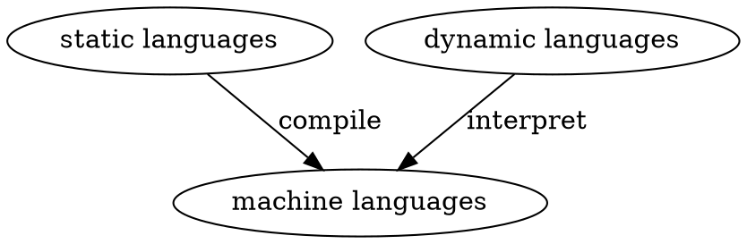

# Glossary
* **Program**: a program is a sequence of instructions that specifies how to perform a computation.

* Basic instructions:
    * **input**: Get data from the keyboard , a file, the network, or some other device.
    * **output**: Display data on the screen, save it in a file, send it over the network.
    * **math**: Perform basic mathematical operations like addition and multiplication.
    * **conditional execution**: Check for certain conditions and run the appropriate code.
    * **repetition**：Perform some action repeatedly, usually with some variation.

* **JSON(JavaScript Object Notation)**: a human-readable text format that describes the types, values, and order of the values within it.

* **Shell**: The program _reads_ what you type in a terminal or terminal window, _runs_ it, and _displays_ the results.
    * Windows: cmd, PowerShell; run _batch_ file with suffix `.bat`
    * Linux and other Unix-like system: many shell programs, the most popular is called _bash_ or _sh_.

* **Shell scripts**: a file comprised of commands for _shell_. Shell scripts don't scale well beyond a few hundred lines, and they are much slower than the alternative languages.

* **static languages**: The programming languages that require you to specify some low-level details for the computer. It requires programmer to specify the _type_ of each variable.(such as _C_, _C++_, _C#_, _Java_) The variables in those languages can't change their type; they are static.

* **dynamic languages (scripting languages)**: The kind of languages that do not force you to declare variable types before using them.(such as _python_, _Perl_, _Ruby_, _PHP_).

* **machine languages**: a very low-level language that run by computer directly.

* **glue code**: Programs comprises both static and dynamic languages.

## Objects, type, variable:
1. **Objects**: In python, everything (booleans, integers, floats, strings, even large data structures, functions,and programs) is implemented as an _object_.

2. **Type**
* Simplest build-in data **type**: **Booleans, integers, floats, strings**
* Type also determines if the data value can be changed (mutable) or is constant (immutable).
* Python is **strongly typed**, which means that the type of an object does not change, even if its value is mutable.
* `type(_object_)`: checking the type of anything.

3. **variables**: names that refer to values in the computer's memory that you can define for use with your program. 
* **=** is used to assign a value to a variable.
* Assignment **does not copy** a value; it just **attach a name** to the object that contains the data. A variable are just _references_ to a thing rather than the thing itself. 
* Variable names can only contain:
    * Lowercase letters (a through z)
    * Uppercase letters (A through Z)
    * Digits (0 through 9)
    * Underscore (_)
    * Can **not** begin with digits.
* Python _reserved words_(don't use them as variable names):

| False  | class    | finally | is       | return |
|:------:| :------: | :-----: | :------: | :----: |
| None   | continue | for     | lambda   | try    |
| True   | def      | from    | nonlocal | while  |
| and    | del      | global  | not      | with   |
| as     | elif     | if      | or       | yield  |
| assert | else     | import  | pass     | break  |
| except | in       | raise   | -------- |
